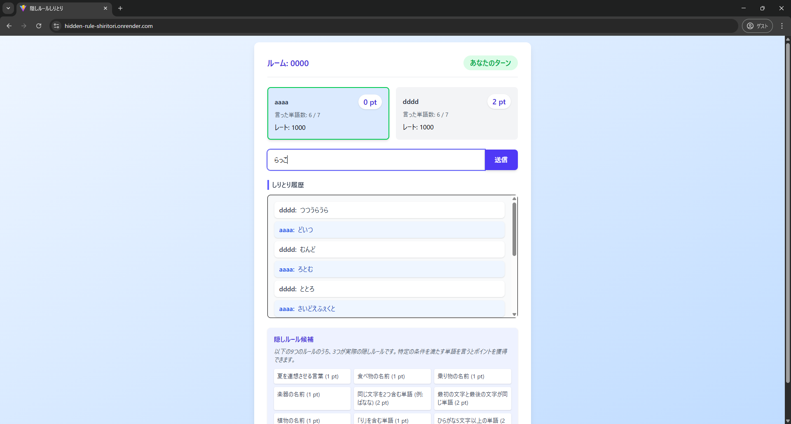
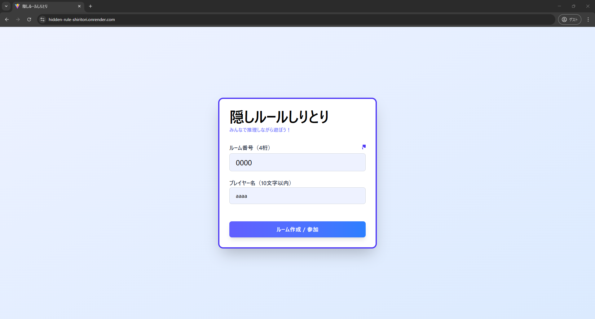
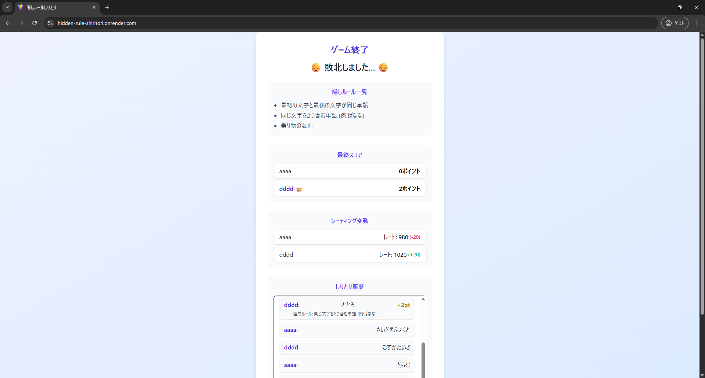

# 隠しルールしりとりゲーム

## ゲーム概要

このゲームは通常のしりとりに隠された条件を見つけ出す要素を加えた言葉遊びです。相手プレイヤーと競いながら隠された条件に合致する言葉を使い、ポイントを獲得します。各プレイヤーが7単語言い終わった時点で、スコアが高いプレイヤーが勝利です。

## 勝利条件

- 7ターン終了時点でポイントが多いプレイヤーが勝利
- または、いずれかのプレイヤーが5ポイントを先取した場合、その時点で勝利

### デモ動画

[こちらのリンク](https://www.youtube.com/watch?v=WgHyHlx5_oc)から、一人でブラウザを2つ使って対戦しているデモ動画をご覧いただけます。

## ゲームの遊び方

### 基本ルール

- 通常のしりとりと同じく、前の単語の最後の文字から始まる言葉を答えます
- 一度使った言葉は使えません
- 言葉の最後に「ん」がついたら負けです
- 7ターンで終了します（各プレイヤーは7つまで単語を言えます）

### 隠しルールとポイント獲得

- 各ゲームには、3つの「隠しポイント獲得条件」が設定されています
  - 例：「尖ったもの」を表す単語を言うと1ポイント獲得
  - 例：3文字の単語を言うと1ポイント獲得
- ゲーム開始時には、3つの本物の条件とダミーの6つの条件の合計9つが表示されます
- 条件に合致する単語を言うと自動的にポイントが加算されます。どのルールでポイント獲得したかはゲーム終了時まで通知されません
- 相手の言葉や自分の言葉から隠された条件を推理しながらゲームを進めましょう

### 入力について

- 単語の入力はひらがなのみ、20文字までです

## 対戦方法

- このゲームはオンラインでの二人対戦です
- 友達と遊ぶ場合は、4桁の数字でルームを作成・入室して対戦できます
  - デフォルトのルーム番号は「0000」です

- [https://hidden-rule-shiritori.onrender.com/](https://hidden-rule-shiritori.onrender.com/) にデプロイしているので、こちらから遊ぶことができます
  - 無料枠でホスティングしているため、アクセスしてからサーバーが起動するまで数十秒～数分程度かかる場合があります

## レーティングシステム

- ゲームの勝敗に応じて、あなたの強さを示す「レート」が変動します
- たくさん遊んで、レートアップを目指しましょう
  ※レート情報は、お使いのブラウザに保存されます

## 技術スタック・特徴

- しりとりの隠しルールの条件判定の一部には、Googleの生成AIであるGeminiを利用しています

## 開発者向け情報

開発者向けのドキュメントは[こちら](./docs/development.md)をご覧ください。

## 隠しルール一覧

- 3文字の単語 (1ポイント)
- 食べ物の名前 (1ポイント)
- 動物の名前 (1ポイント)
- 色を表す単語 (1ポイント)
- ひらがな5文字以上の単語 (2ポイント)
- 「り」を含む単語 (1ポイント)
- 濁音もしくは半濁音を含む単語 (1ポイント)
- 植物の名前 (1ポイント)
- 乗り物の名前 (1ポイント)
- 同じ文字を2つ含む単語 (例: ばなな) (2ポイント)
- 最初の文字と最後の文字が同じ単語 (2ポイント)
- 天候に関する言葉 (1ポイント)
- スポーツの名前 (1ポイント)
- 楽器の名前 (1ポイント)
- 丸い形を連想させる言葉 (1ポイント)
- 柔らかいものを表す言葉 (1ポイント)
- 甘いものを表す言葉 (1ポイント)
- 夏を連想させる言葉 (1ポイント)
- 前の単語と関連性の高い言葉 (2ポイント)
- 前の単語より文字数が多い言葉 (2ポイント)
- 体の部位 (1ポイント)
- 伸ばし棒（長音）を含む単語 (1ポイント)
